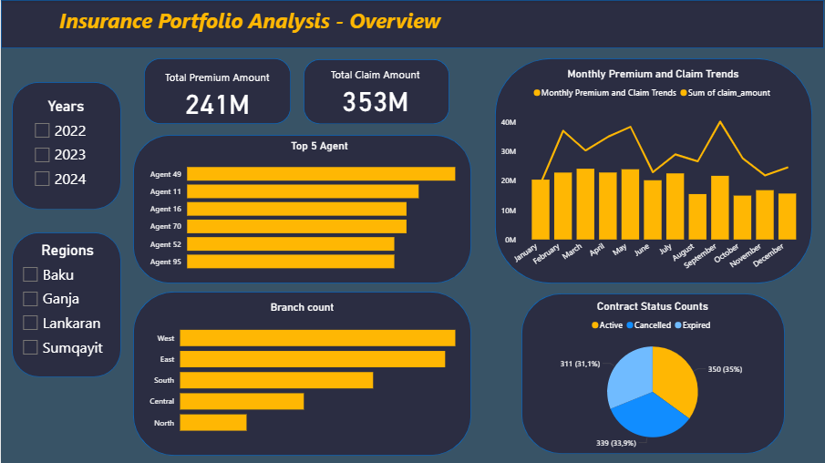
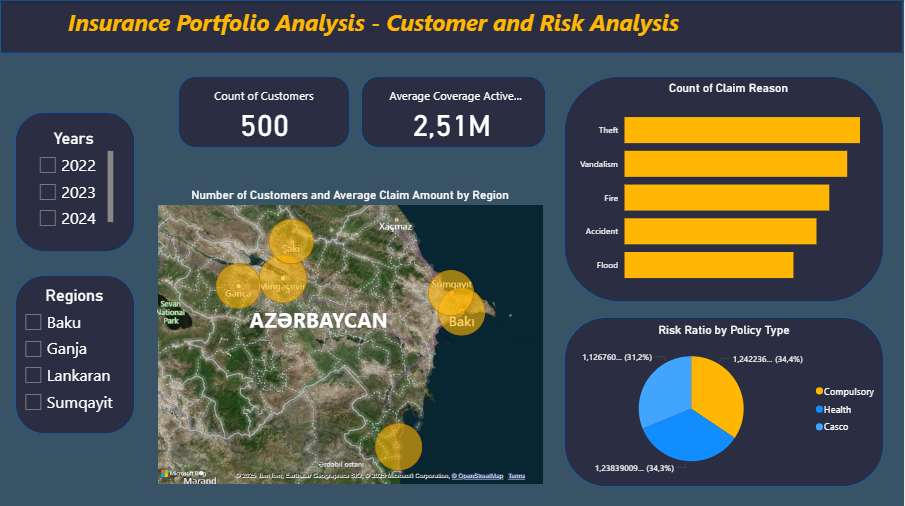
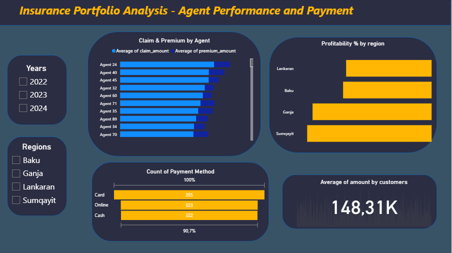

# Insurance Portfolio Analysis – Power BI Project

This Power BI project provides a comprehensive analysis of an insurance company’s portfolio performance, customer behavior, risk distribution, and agent efficiency.  
The report consists of **three main pages**: Overview, Customer & Risk Analysis, and Agent Performance & Payment.

# 1.Overview Page

The **Overview** page provides a high-level summary of the insurance portfolio.

### Key Insights:
- **Total Premium Amount**
- **Total Claim Amount**
- **Top 5 Agents**
- **Branch Count**
- **Monthly Premium & Claim Trends**
- **Contract Status Counts** (Active, Completed, Cancelled)

# 2.Customer and Risk Analysis Page

This page focuses on customer segmentation, risk evaluation, and regional differences.

### Key Insights:
- **Total Number of Customers**
- **Average Coverage (Active Status)**
- **Customers & Average Claim Amount by Region**
- **Customers Count**

# 3.Agent Performance and Payment Page

This page evaluates agent performance and payment-related behavior.

### Key Insights:
- **Claims & Premium by Agent**
- **Count of Payment Methods**
- **Profitability by Region**
- **Average Claim Amount by Customer**

### Author: Sevinc Qiyasova